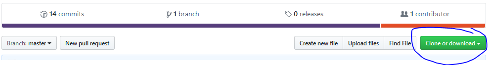
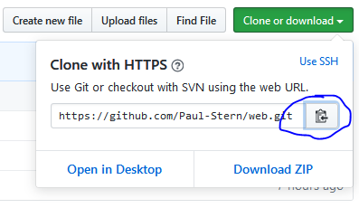
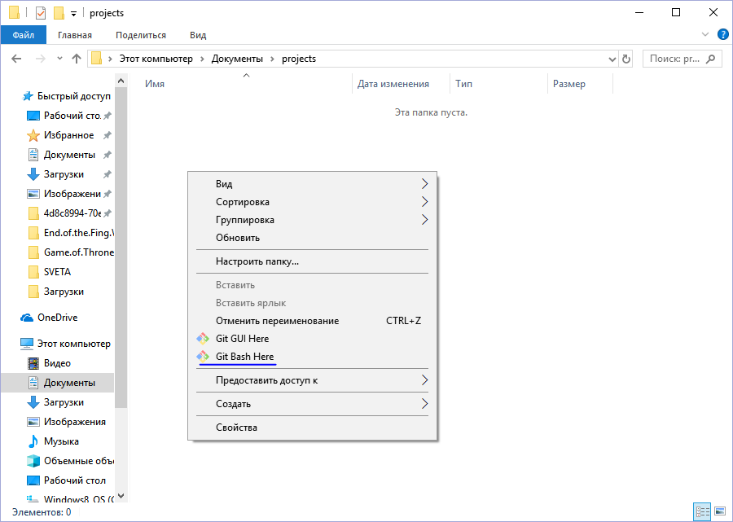
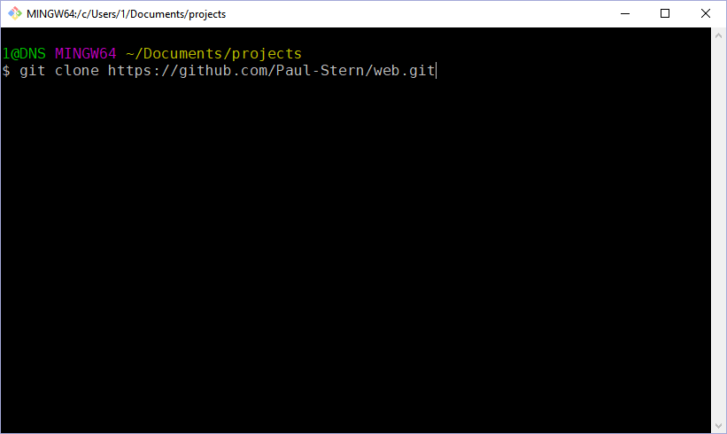
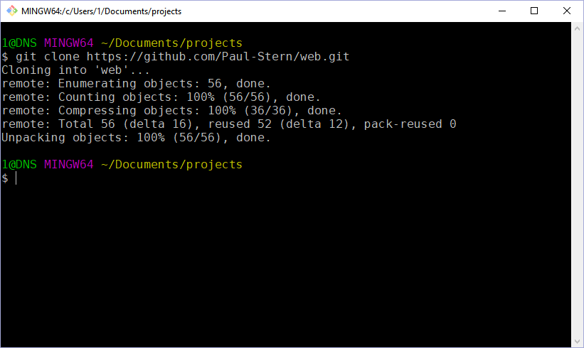

# Table of Contents

1.  [Получение копии проекта на диск](#orge4d5f2e)
2.  [Обновление существующего проекта из GitHub](#org66a5c7e)

Целью данного задания является создание локальной копии репозитория на Вашем компьютере.
В результате Вы получите копию рабочей директории на жестком диске (не на флешке).
Вы также можете работать с флешки (см. раздел "Обновление"), но это не рекомендуется

# Получение копии проекта на диск

1.  Скачайте и установите git
2.  Зайдите в свой репозиторий на [GitHub](http://github.com/)

3.  Скопируйте *ссылку* (достаточно нажать на указанную кнопку)

4.  Сделайте команду `Git Bash Here` в папке, в которую хотите поместить папку с проектом. Внимание! Папка не должна уже содержать проект.

5.  В открывшейся командной строке напишите
    -   git clone *ссылка*

Ваш локальный репозиторий готов!

# Обновление существующего проекта из GitHub

1.  Выполните команду `Git Bash Here` в папке с проектом
2.  В командной строке выполните команду `git pull`

